# High-Level Repository Coordination & Orchestration Plan
This document outlines the architectural plan for integrating PostgreSQL-backed persistence at the orchestrator layer of the **Royal Flush Network (RFN 2.0)** system. 

Currently, our four core business logic crates (`flushline`, `matrix`, `pot_bonus`, and `sponsor_allocator` / `potbonus` in the standalone suite) have highly optimized relational schemas and repository layers implemented under Option 1. However, the orchestrator/coordinator layer (`account_aggregator` and `system_integration`) still operates primarily in-memory or through standard synchronous calls.

To ensure strict durability, transaction safety, and eventual consistency across bounded contexts in production, we must elevate the orchestrator to a database-backed coordinator utilizing the **Transactional Outbox and Idempotent Inbox Patterns**.

---

## 1. Architectural Blueprint: Event-Driven Coordination

The high-level coordinator (`AccountAggregator`) acts as a saga orchestrator. Instead of relying on volatile, in-memory channels that lose state upon server restart, the system will use PostgreSQL tables as reliable message queues.

```mermaid
sequenceDiagram
    autonumber
    participant FL as Flushline Context
    participant MT as Matrix Context
    participant AGG as Account Aggregator (Saga)
    participant SP as Sponsor Allocator Context
    participant PB as PotBonus Context
    participant DB as PostgreSQL Database

    Note over FL,DB: Scenario: Matrix Cycles, Triggering Cascades and Graduation
    FL->>DB: 1. Process points & save state + append outbox (Tx)
    MT->>DB: 2. Process placement, cycle & save state + append outbox (Tx)
    
    loop Outbox Processor Polling (or LISTEN/NOTIFY)
        AGG->>DB: 3. Poll unprocessed events from outbox tables
        DB-->>AGG: 4. Returns MatrixCycled & FlushlineGraduated events
    end

    rect rgb(25, 30, 45)
        Note over AGG,DB: Transaction Boundary: Process MatrixCycled Event
        AGG->>DB: 5. Start Transaction
        AGG->>DB: 6. Log event UUID in 'orchestrator_inbox_log' (Deduplication)
        AGG->>DB: 7. Apply +9 points to Flushline (writes Flushline outbox if Graduated)
        AGG->>DB: 8. Distribute +6 points to Queen cardline
        AGG->>DB: 9. Record cycle in 'pot_bonus_weekly_cycles'
        AGG->>DB: 10. Update 'coordination_states' (matrix_cycled = true)
        AGG->>DB: 11. Commit Transaction
    end

    rect rgb(35, 25, 45)
        Note over AGG,DB: Transaction Boundary: Free Account Creation (When both criteria met)
        AGG->>DB: 12. Start Transaction
        AGG->>AGG: 13. Detect both 'flushline_graduated' and 'matrix_cycled' are true
        AGG->>DB: 14. Query & allocate Sponsor (Cap <= 10 constraint checked)
        AGG->>DB: 15. Create new free account in Flushline
        AGG->>DB: 16. Initialize new forced-matrix tree for owner
        AGG->>DB: 17. Reset 'coordination_states' for original account
        AGG->>DB: 18. Commit Transaction
    end
```



---

## 2. Relational Database Schema for Orchestrator

We will add a new database migration file: `account_aggregator/migrations/20260624000000_create_orchestrator_coordination_tables.sql`.

This schema will track:
1.  **State Coordination**: Persisting `account_states` to survive restarts.
2.  **Idempotent Inbox Log**: Preventing duplicate event processing.

```sql
-- 1. Coordination state table (tracks graduation and matrix cycles)
CREATE TABLE orchestrator_coordination_states (
    account_id UUID PRIMARY KEY,
    is_flushline_graduated BOOLEAN NOT NULL DEFAULT FALSE,
    is_matrix_cycled BOOLEAN NOT NULL DEFAULT FALSE,
    new_account_spawned BOOLEAN NOT NULL DEFAULT FALSE,
    updated_at TIMESTAMP WITH TIME ZONE NOT NULL DEFAULT NOW()
);

-- Index to quickly query accounts qualified for free account spawning
CREATE INDEX idx_orchestrator_coordination_qualified 
ON orchestrator_coordination_states (is_flushline_graduated, is_matrix_cycled)
WHERE (is_flushline_graduated = TRUE AND is_matrix_cycled = TRUE AND new_account_spawned = FALSE);

-- 2. Idempotent Inbox Log (deduplication of consumed events)
CREATE TABLE orchestrator_inbox_log (
    event_id UUID PRIMARY KEY,
    event_type VARCHAR(50) NOT NULL,
    consumed_at TIMESTAMP WITH TIME ZONE NOT NULL DEFAULT NOW()
);
```

---

## 3. Redesigned Rust Interface

To bridge our core crates under the async database-backed engine, we will introduce a PostgreSQL-backed `PgAccountAggregator` inside `account_aggregator/src/lib.rs`.

```rust
use async_trait::async_trait;
use sqlx::{PgPool, Transaction, Postgres};
use uuid::Uuid;
use std::collections::HashMap;

// Re-map internal errors to a unified coordinator error
#[derive(Debug, thiserror::Error)]
pub enum AggregatorError {
    #[error("Database error: {0}")]
    Database(#[from] sqlx::Error),
    #[error("Flushline error: {0}")]
    Flushline(String),
    #[error("Matrix error: {0}")]
    Matrix(String),
    #[error("Sponsor Allocator error: {0}")]
    Sponsor(String),
    #[error("Event already processed: {0}")]
    DuplicateEvent(Uuid),
}

/// Postgres-backed Account Aggregator and Orchestrator.
pub struct PgAccountAggregator {
    pool: PgPool,
    // Connections/pools are cloned/passed into repository instances
    flushline_repo: flushline::repository::PgFlushlineRepository,
    matrix_repo: matrix::repository::PgMatrixRepository,
    sponsor_repo: sponsor_allocator::repository::PgSponsorRepository,
    pot_bonus_repo: pot_bonus::repository::PgPotBonusRepository,
}

impl PgAccountAggregator {
    pub fn new(pool: PgPool) -> Self {
        Self {
            pool: pool.clone(),
            flushline_repo: flushline::repository::PgFlushlineRepository::new(pool.clone()),
            matrix_repo: matrix::repository::PgMatrixRepository::new(pool.clone()),
            sponsor_repo: sponsor_allocator::repository::PgSponsorRepository::new(pool.clone()),
            pot_bonus_repo: pot_bonus::repository::PgPotBonusRepository::new(pool),
        }
    }

    /// Process a single "Matrix Cycled" event transactionally.
    pub async fn handle_matrix_cycled(
        &self,
        event_id: Uuid,
        account_id: Uuid,
        matrix_id: Uuid,
    ) -> Result<Option<Uuid>, AggregatorError> {
        let mut tx = self.pool.begin().await?;

        // 1. Deduplication Check
        if let Err(_) = self.mark_event_consumed(&mut tx, event_id, "MatrixCycled").await {
            // Event was already processed, early exit with Ok (idempotent)
            return Ok(None);
        }

        // 2. Fetch or create coordination state
        let mut state = self.get_or_create_coordination_state(&mut tx, account_id).await?;
        state.is_matrix_cycled = true;

        // 3. Forward to Sponsor & PotBonus (using shared transaction)
        self.sponsor_repo.handle_matrix_cycled_tx(&mut tx, account_id, matrix_id).await
            .map_err(|e| AggregatorError::Sponsor(e.to_string()))?;
        self.pot_bonus_repo.handle_matrix_cycled_tx(&mut tx, account_id, matrix_id).await
            .map_err(|e| AggregatorError::Sponsor(e.to_string()))?;

        // 4. Force cycle the account with 9 points in Flushline
        let mut flushline = self.flushline_repo.load_tx(&mut tx).await
            .map_err(|e| AggregatorError::Flushline(e.to_string()))?;
        
        let flushline_account_id = flushline::domain::AccountId::from(account_id);
        flushline.force_cyle(
            &flushline_account_id, 
            9, 
            flushline::domain::distribution_strategy::DistributionSequence::default()
        ).map_err(|e| AggregatorError::Flushline(e.to_string()))?;

        // 5. Distribute 6 points to Queen cardline
        flushline.distribute_points_to_queen(6)
            .map_err(|e| AggregatorError::Flushline(e.to_string()))?;

        // 6. Save back Flushline & coordination states
        self.flushline_repo.save_tx(&mut tx, &flushline).await
            .map_err(|e| AggregatorError::Flushline(e.to_string()))?;
        self.save_coordination_state(&mut tx, &state).await?;

        tx.commit().await?;

        // Check if both criteria are now met for a free account spawn
        self.check_and_spawn_free_account(account_id).await
    }

    /// Process a single "Flushline Graduated" event transactionally.
    pub async fn handle_flushline_graduated(
        &self,
        event_id: Uuid,
        account_id: Uuid,
    ) -> Result<Option<Uuid>, AggregatorError> {
        let mut tx = self.pool.begin().await?;

        if let Err(_) = self.mark_event_consumed(&mut tx, event_id, "FlushlineGraduated").await {
            return Ok(None);
        }

        let mut state = self.get_or_create_coordination_state(&mut tx, account_id).await?;
        state.is_flushline_graduated = true;

        self.sponsor_repo.handle_flushline_graduated_tx(&mut tx, account_id).await
            .map_err(|e| AggregatorError::Sponsor(e.to_string()))?;
        self.pot_bonus_repo.handle_flushline_graduated_tx(&mut tx, account_id).await
            .map_err(|e| AggregatorError::Sponsor(e.to_string()))?;

        self.save_coordination_state(&mut tx, &state).await?;
        tx.commit().await?;

        self.check_and_spawn_free_account(account_id).await
    }

    /// Check if account coordinates qualify for free account creation, and perform it transactionally.
    pub async fn check_and_spawn_free_account(&self, account_id: Uuid) -> Result<Option<Uuid>, AggregatorError> {
        let mut tx = self.pool.begin().await?;

        let state = self.get_or_create_coordination_state(&mut tx, account_id).await?;
        if state.is_flushline_graduated && state.is_matrix_cycled && !state.new_account_spawned {
            
            // 1. Allocate a sponsor from PgSponsorRepository
            let mut sponsor_service = self.sponsor_repo.load_tx(&mut tx).await
                .map_err(|e| AggregatorError::Sponsor(e.to_string()))?;
            
            let new_account_id = Uuid::now_v7();
            let sponsor_uuid = sponsor_service.allocate_sponsor(new_account_id)
                .map_err(|e| AggregatorError::Sponsor(e.to_string()))?;
            
            self.sponsor_repo.save_tx(&mut tx, &sponsor_service).await
                .map_err(|e| AggregatorError::Sponsor(e.to_string()))?;

            // 2. Create Flushline account
            let mut flushline = self.flushline_repo.load_tx(&mut tx).await
                .map_err(|e| AggregatorError::Flushline(e.to_string()))?;
            
            let new_flushline_id = flushline::domain::AccountId::from(new_account_id);
            let flushline_account = flushline::domain::Account::new(
                new_flushline_id.clone(),
                format!("FreeAccount_{}", new_account_id)
            );
            flushline.add_account(flushline_account)
                .map_err(|e| AggregatorError::Flushline(e.to_string()))?;
            
            flushline.register_graduated_account(flushline::domain::AccountId::from(account_id));
            self.flushline_repo.save_tx(&mut tx, &flushline).await
                .map_err(|e| AggregatorError::Flushline(e.to_string()))?;

            // 3. Create new forced forced-matrix tree
            let mut matrix_service = self.matrix_repo.load_service_tx(&mut tx).await
                .map_err(|e| AggregatorError::Matrix(e.to_string()))?;
            
            let matrix_account_id = matrix::domain::value_objects::AccountId::from(new_account_id);
            matrix_service.create_matrix(matrix_account_id);
            
            self.matrix_repo.save_service_tx(&mut tx, &matrix_service).await
                .map_err(|e| AggregatorError::Matrix(e.to_string()))?;

            // 4. Update coordination state to track completion and prevent multi-spawning
            let mut updated_state = state;
            updated_state.new_account_spawned = true;
            updated_state.is_flushline_graduated = false;
            updated_state.is_matrix_cycled = false;
            self.save_coordination_state(&mut tx, &updated_state).await?;

            tx.commit().await?;
            Ok(Some(new_account_id))
        } else {
            Ok(None)
        }
    }
}

// Private helper structures and methods
struct CoordinatedState {
    account_id: Uuid,
    is_flushline_graduated: bool,
    is_matrix_cycled: bool,
    new_account_spawned: bool,
}

impl PgAccountAggregator {
    async fn mark_event_consumed(&self, tx: &mut Transaction<'_, Postgres>, event_id: Uuid, event_type: &str) -> Result<(), sqlx::Error> {
        sqlx::query(
            "INSERT INTO orchestrator_inbox_log (event_id, event_type) VALUES ($1, $2)"
        )
        .bind(event_id)
        .bind(event_type)
        .execute(&mut **tx)
        .await?;
        Ok(())
    }

    async fn get_or_create_coordination_state(&self, tx: &mut Transaction<'_, Postgres>, account_id: Uuid) -> Result<CoordinatedState, sqlx::Error> {
        let row = sqlx::query(
            "SELECT is_flushline_graduated, is_matrix_cycled, new_account_spawned \
             FROM orchestrator_coordination_states WHERE account_id = $1"
        )
        .bind(account_id)
        .fetch_optional(&mut **tx)
        .await?;

        if let Some(r) = row {
            use sqlx::Row;
            Ok(CoordinatedState {
                account_id,
                is_flushline_graduated: r.get("is_flushline_graduated"),
                is_matrix_cycled: r.get("is_matrix_cycled"),
                new_account_spawned: r.get("new_account_spawned"),
            })
        } else {
            Ok(CoordinatedState {
                account_id,
                is_flushline_graduated: false,
                is_matrix_cycled: false,
                new_account_spawned: false,
            })
        }
    }

    async fn save_coordination_state(&self, tx: &mut Transaction<'_, Postgres>, state: &CoordinatedState) -> Result<(), sqlx::Error> {
        sqlx::query(
            "INSERT INTO orchestrator_coordination_states (account_id, is_flushline_graduated, is_matrix_cycled, new_account_spawned, updated_at) \
             VALUES ($1, $2, $3, $4, NOW()) \
             ON CONFLICT (account_id) DO UPDATE SET \
                 is_flushline_graduated = EXCLUDED.is_flushline_graduated, \
                 is_matrix_cycled = EXCLUDED.is_matrix_cycled, \
                 new_account_spawned = EXCLUDED.new_account_spawned, \
                 updated_at = NOW()"
        )
        .bind(state.account_id)
        .bind(state.is_flushline_graduated)
        .bind(state.is_matrix_cycled)
        .bind(state.new_account_spawned)
        .execute(&mut **tx)
        .await?;
        Ok(())
    }
}
```

---

## 4. Polling & Event Delivery Processor (Daemon Worker)

To drive coordination automatically without blocking critical user API paths, we will introduce a background worker thread/task in `system_integration` or `account_aggregator` that polls context-specific outboxes and triggers the coordinator.

```rust
pub async fn start_orchestrator_daemon(aggregator: Arc<PgAccountAggregator>, pool: PgPool) {
    let mut interval = tokio::time::interval(std::time::Duration::from_millis(500));
    loop {
        interval.tick().await;

        // 1. Process Matrix Cycled Events
        if let Ok(events) = fetch_matrix_outbox(&pool).await {
            for event in events {
                match aggregator.handle_matrix_cycled(event.id, event.account_id, event.matrix_id).await {
                    Ok(_) => mark_matrix_event_processed(&pool, event.id).await.ok(),
                    Err(e) => eprintln!("Error coordinating MatrixCycled event {}: {:?}", event.id, e),
                };
            }
        }

        // 2. Process Flushline Graduated Events
        if let Ok(events) = fetch_flushline_outbox(&pool).await {
            for event in events {
                match aggregator.handle_flushline_graduated(event.id, event.account_id).await {
                    Ok(_) => mark_flushline_event_processed(&pool, event.id).await.ok(),
                    Err(e) => eprintln!("Error coordinating FlushlineGraduated event {}: {:?}", event.id, e),
                };
            }
        }
    }
}
```

---

## 5. Verification & Testing Strategy

To ensure zero regressions and mathematically sound saga completion:

1.  **Transactional Rollback Verification**:
    *   Inject artificial database errors inside step 15 (Free Account creation) and assert that changes in Step 7 (+9 Flushline points) and Step 10 (coordination state update) roll back completely.
2.  **Concurrency Testing**:
    *   Simulate concurrent matrix cycling and flushline graduations from 50+ users simultaneously. Verify that duplicate account spawns are prevented via transaction locks.
3.  **Idempotence/At-Least-Once Replay**:
    *   Wreak havoc on the daemon processor by feeding it duplicate event IDs. Assert that `orchestrator_inbox_log` constraints successfully ignore duplicates and return `Ok`.
